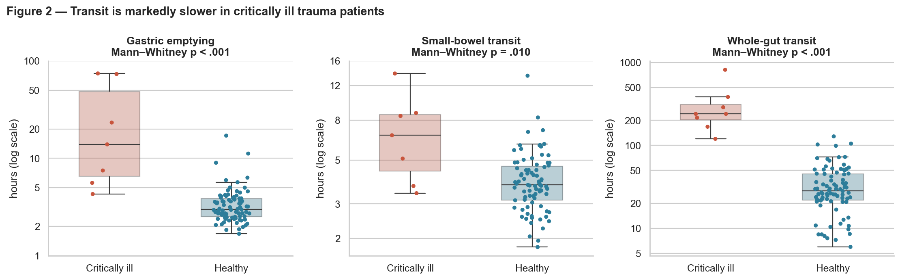
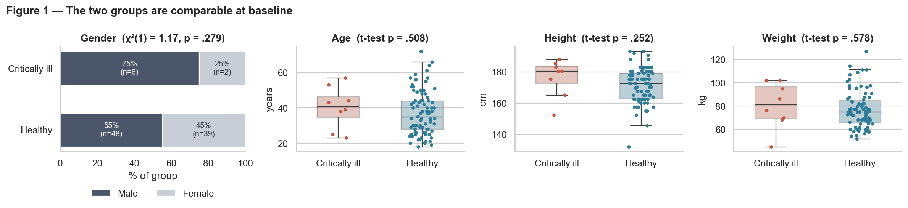
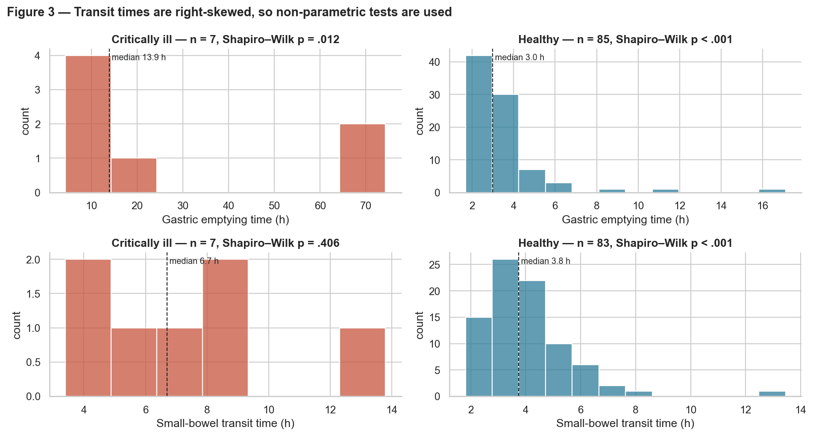
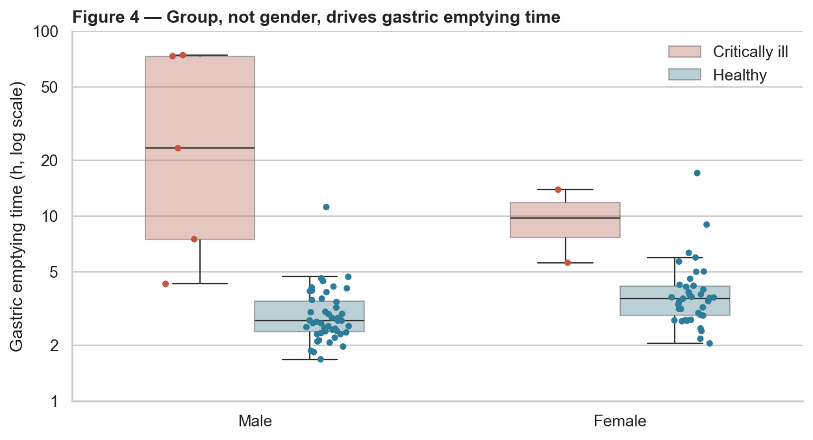
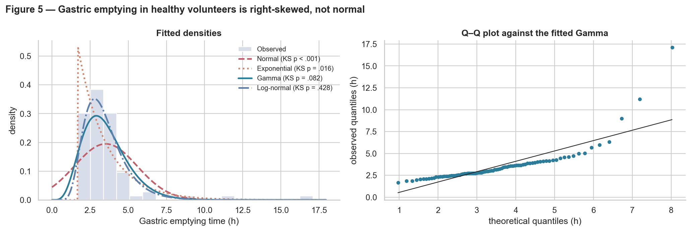
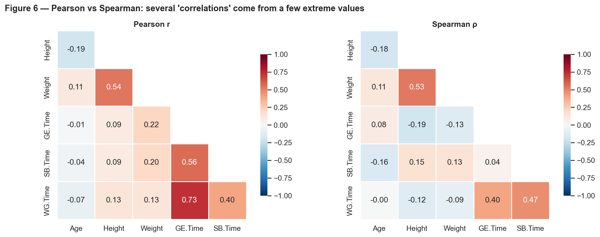
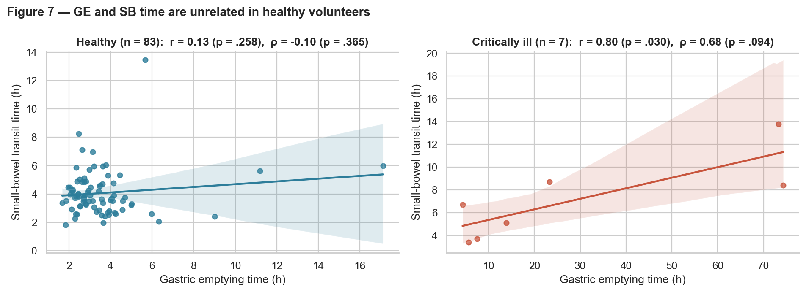
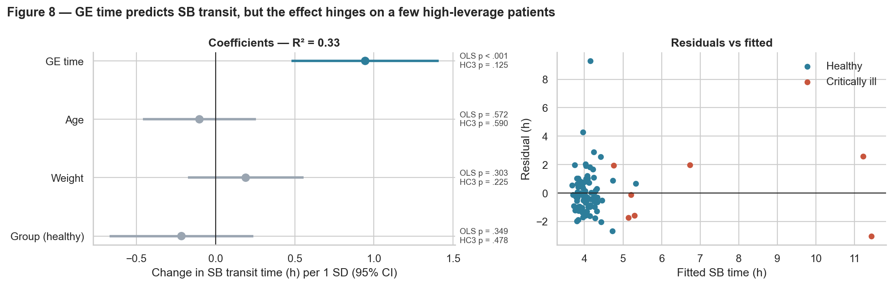

# Gut transit in critically ill trauma patients: a statistical re-analysis


**M.Sc. project · March 2026** · SRH University · Module ADSA04 *Statistics & Machine Learning*

This is a re-analysis of the clinical study by **Rauch et al. (2012, *Journal of Critical Care*)**. Every participant swallowed a wireless *SmartPill* motility capsule, and the study compared how fast food moves through the gut in **8 ventilated trauma patients** and **87 healthy volunteers**.

The project was originally done in JASP for the *Statistics & Machine Learning* module of my M.Sc. in Applied Data Science & AI (SRH University, winter term 2025/26). This repository rebuilds the whole analysis in Python, so every number and figure can be reproduced from the raw data.

> **Question:** Do critically ill trauma patients have slower gastric emptying and small-bowel transit than healthy people?
> **Answer:** Yes. Gastric emptying takes about **4.5× longer** (median 13.9 h vs 3.0 h, p < .001), and small-bowel transit is also prolonged (6.7 h vs 3.8 h, p = .010).



---

## Key results

| Outcome | Critically ill, median [IQR] | Healthy, median [IQR] | Mann–Whitney *U* | p | Effect size (rank-biserial r) |
|---|---|---|---|---|---|
| **Gastric emptying (h)** | 13.9 [6.5–48.3], n = 7 | 3.0 [2.5–3.9], n = 85 | 573.0 | **< .001** | 0.93 |
| **Small-bowel transit (h)** | 6.7 [4.4–8.6], n = 7 | 3.8 [3.1–4.7], n = 83 | 461.5 | **.010** | 0.59 |
| **Whole-gut transit (h)** | 240 [204–312], n = 8 | 28.5 [21.8–45.6], n = 86 | 687.0 | **< .001** | 1.00 |

There are two primary outcomes, so they are tested at a Bonferroni-corrected **α = 0.025**. Both remain significant.

| Analysis | Result |
|---|---|
| Baseline balance (age, height, weight) | No group differences: *t*-tests p = .51 / .25 / .58 |
| Gender × group | χ²(1) = 1.17, p = .28; Fisher's exact p = .46. The groups are matched |
| Delayed gastric emptying (> 2.99 h) | 7 of 7 patients vs 42 of 85 volunteers. OR = 15.4 (95% CI 0.9–277), Fisher p = .013 |
| GE time by gender (ANOVA) | F(1, 90) = 0.71, p = .40, so no gender effect |
| GE time by race (healthy volunteers) | ANOVA F = 0.25, p = .78; Kruskal–Wallis p = .57 |
| Best-fitting distribution for GE time | Normal rejected (KS p < .001). Log-normal fits best (p = .43), Gamma is acceptable (p = .08) |
| Multiple regression: SB ~ GE + Age + Weight + Group | R² = 0.33. GE time is the only significant predictor, **but not with robust (HC3) standard errors** |

## What the analysis shows

1. **Motility is severely impaired in critically ill trauma patients.** Every patient with a measurement had delayed gastric emptying, and whole-gut transit was about 8× longer. This matters for planning enteral nutrition in the ICU.
2. **Choosing the right test matters.** Transit times are strongly right-skewed (Shapiro–Wilk p < .05). Welch's *t*-test misses the gastric-emptying difference (p = .076) because a few extreme values inflate the variance. The rank-based Mann–Whitney test finds it clearly (p < .001).
3. **Pearson vs Spearman changes the conclusion.** The pooled Pearson correlation between gastric emptying and small-bowel transit is r = 0.57, but Spearman's ρ is only 0.04. Among the healthy volunteers there is no relationship at all (r = 0.13, p = .26). The apparent link comes from a handful of patients who are extreme on both variables. The regression shows the same thing: the GE effect disappears with heteroscedasticity-robust standard errors.
4. **Small samples need humility.** With 7–8 patients, effect estimates are imprecise, which is why the odds-ratio confidence interval runs from 0.9 to 277. This is a pilot study, and the results should be read that way.

## Figures

| | |
|---|---|
|  |  |
| **Fig 1.** The groups are comparable at baseline | **Fig 3.** Right-skewed transit times, so non-parametric tests |
|  |  |
| **Fig 4.** Group, not gender, drives GE time | **Fig 5.** Normal vs Exponential vs Gamma vs Log-normal |
|  |  |
| **Fig 6.** Pearson vs Spearman correlation matrices | **Fig 7.** GE vs SB time within each group |


**Fig 8.** Multiple regression coefficients with ordinary and robust p-values, and residuals.

## Methods

| Step | Methods used |
|---|---|
| Study design | Prospective observational cohort with an external healthy control group (NCT01159002); no randomisation |
| Variable types | Nominal (group, gender, race), continuous ratio (times, age, height, weight), interval (pH), counts (contractions) |
| Descriptive statistics | Mean ± SD, median [IQR], missing-data audit |
| Group comparisons | Student's and Welch's *t*-test, Mann–Whitney *U*, rank-biserial effect size, Bonferroni correction |
| Categorical data | 2 × 2 contingency tables, χ², Fisher's exact test, odds ratio with Haldane–Anscombe correction |
| Assumption checks | Shapiro–Wilk, Levene, Q–Q plots, residual diagnostics |
| More than two groups | One-way ANOVA (Type III), Kruskal–Wallis |
| Distribution fitting | Maximum-likelihood fits; Kolmogorov–Smirnov goodness of fit; AIC |
| Association | Pearson and Spearman correlation |
| Modelling | OLS multiple regression with standardised predictors, HC3-robust standard errors, prediction intervals |

## Repository structure

```
├── smartpill_analysis.ipynb   # full analysis with narrative, tables and figures
├── data/
│   ├── smartpill.csv          # 95 participants × 22 variables
│   └── README.md              # data dictionary and source
├── figures/                   # all figures, generated by the notebook
├── requirements.txt
└── README.md
```

## Reproduce

```bash
git clone https://github.com/Chandana18G/rauch2012-statistical-replication.git
cd rauch2012-statistical-replication
pip install -r requirements.txt
jupyter notebook smartpill_analysis.ipynb
```

Running the notebook from top to bottom regenerates every table and every figure in `figures/`.

## Data

The **Smart Pill dataset** was contributed by Dr Amy Nowacki (Cleveland Clinic) to the TSHS Resources Portal (2017). It is distributed in the R package [`medicaldata`](https://github.com/higgi13425/medicaldata) under the MIT licence. See [`data/README.md`](data/README.md) for the full variable dictionary.

## Reference

Rauch S, Krueger K, Turan A, You J, Roewer N, Sessler DI. *Use of wireless motility capsule to determine gastric emptying and small intestinal transit times in critically ill trauma patients.* **J Crit Care.** 2012;27(5):534.e7–534.e12. [doi:10.1016/j.jcrc.2011.12.002](https://doi.org/10.1016/j.jcrc.2011.12.002)

---

**Chandana Gurusiddappa** · M.Sc. Applied Data Science & AI, SRH University · [Portfolio](https://chandana18g.github.io) · [LinkedIn](https://www.linkedin.com/in/chandana-gurusiddappa-785563223/)
